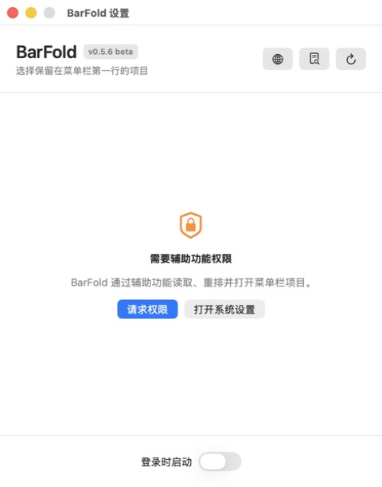

# BarFold

<div align="center">

**A compact second row for crowded macOS menu bars.**

English | [简体中文](README_CN.md) | [日本語](README_JA.md)


[](LICENSE)
[](../../actions/workflows/build.yml)

</div>

BarFold is a native macOS utility that moves selected menu bar items into a compact second row below the menu bar. It is designed for Macs with a notch and for smaller displays where status items run out of space.

## Preview

<div align="center">
  
  <br><br>
  
</div>

The checked items stay in the first menu bar row. Unchecked items are moved into BarFold's second row.

## Features

- Discover menu bar items through macOS Accessibility APIs.
- Move selected items into a collapsible second row without leaving placeholder gaps.
- Open or collapse the second row from the BarFold status item.
- Collapse automatically after clicking elsewhere, or press `Esc`.
- Open the associated application or settings page by clicking a second-row item.
- Drag second-row icons to keep a stable custom order.
- Keep the settings list in place while changing selections.
- Preserve the pointer position and hide synthetic drag movement while reorganizing items.
- Re-apply saved row placement when menu bar apps launch, restart, or appear during login.
- Keep macOS-locked Control Center and Clock items in the first row.
- Move all discoverable items to the second row on first launch by default.
- Launch at login and support multiple displays.
- Keep rotating diagnostic logs locally for troubleshooting.
- Follow the system language or choose Simplified Chinese, Traditional Chinese, English, Japanese, Korean, French, German, or Spanish.

## Requirements

- macOS 13 Ventura or later.
- Accessibility permission for discovering and rearranging menu bar items.
- A menu bar item that exposes enough Accessibility information to be moved.

BarFold is not intended for Mac App Store distribution because it relies on Accessibility events and WindowServer menu bar window information that macOS does not expose as a public status-item management API.

## Install

1. Download `BarFold-x.y.z.zip` from [GitHub Releases](../../releases/latest).
2. Unzip it and move `BarFold.app` to `/Applications` before granting permission.
3. Open BarFold. If macOS blocks an ad-hoc signed build, Control-click the app and choose **Open**, or allow it in **System Settings > Privacy & Security**.
4. Open **System Settings > Privacy & Security > Accessibility** and enable BarFold.
5. Open BarFold settings and check the items that should remain in the first row. Unchecked items move to the second row.
6. Click the BarFold menu bar icon to expand or collapse the second row.

Moving the app or replacing it with a build that has a different code signature can cause macOS to request Accessibility permission again.

## Usage

### Choose where items appear

Open settings from the gear button in the second row, or right-click the BarFold status item and choose **Settings**. Checked items stay in the first row; unchecked items are folded into the second row.

### Use the second row

- Click the BarFold status item once to expand it and again to collapse it.
- Click an item to open its associated application. Menu-only apps may open their preferences instead.
- Drag an item left or right to change its order in the second row.
- Click outside the second row or press `Esc` to close it.
- Use the refresh button after installing, quitting, or rearranging another menu bar app.

### Change language

Open settings and click the globe button in the upper-right corner. Language changes take effect immediately and persist across launches.

## Build from source

Requirements: Xcode 16 or a Swift 6 toolchain.

```bash
git clone <your-repository-url>
cd BarFold
chmod +x scripts/package-app.sh scripts/build-release.sh
./scripts/build-release.sh
open dist/BarFold.app
```

The release archive is written to `outputs/BarFold-<version>.zip`. Builds use the first local Apple Development identity when available; otherwise they are ad-hoc signed. Set a specific identity explicitly when needed:

```bash
BARFOLD_SIGNING_IDENTITY="Developer ID Application: Your Name (TEAMID)" \
  ./scripts/build-release.sh
```

## GitHub Actions

The workflow in [`.github/workflows/build.yml`](.github/workflows/build.yml) is ready for a public GitHub repository:

- Pushes and pull requests compile with warnings treated as errors, package the app, verify the signature and ZIP, and upload a workflow artifact.
- Tags matching `v*` create or update a GitHub Release with the ZIP attached.
- A tag must match `CFBundleShortVersionString`; for example, app version `0.5.8` requires tag `v0.5.8`.

To publish a release after configuring the GitHub remote:

```bash
git push origin main
git push origin v0.5.8
```

GitHub-hosted builds are ad-hoc signed unless a signing certificate is added to the workflow. For frictionless public distribution, use a Developer ID Application certificate and notarize the release outside the default workflow.

## Diagnostics

Click the diagnostic-log button in the upper-right corner of settings to reveal:

```text
~/Library/Application Support/BarFold/barfold.log
```

Logs remain on the Mac and are never uploaded by BarFold. The log rotates at 1 MB to `barfold.previous.log`, keeping the two most recent files.

## Limitations

- Control Center and Clock are locked by macOS and cannot be moved.
- Some third-party status items do not expose enough Accessibility information or reject synthetic drag events.
- Major macOS updates may require BarFold compatibility changes.
- Second-row clicks open applications or preferences; BarFold does not reproduce each app's native status menu.

When reporting a move or launch failure, include the macOS version, BarFold version, affected app name, and the relevant diagnostic-log excerpt.

## License

Copyright 2026 BarFold contributors.

Licensed under the [Apache License, Version 2.0](LICENSE). You may use, modify, and distribute this project under the terms of that license.
